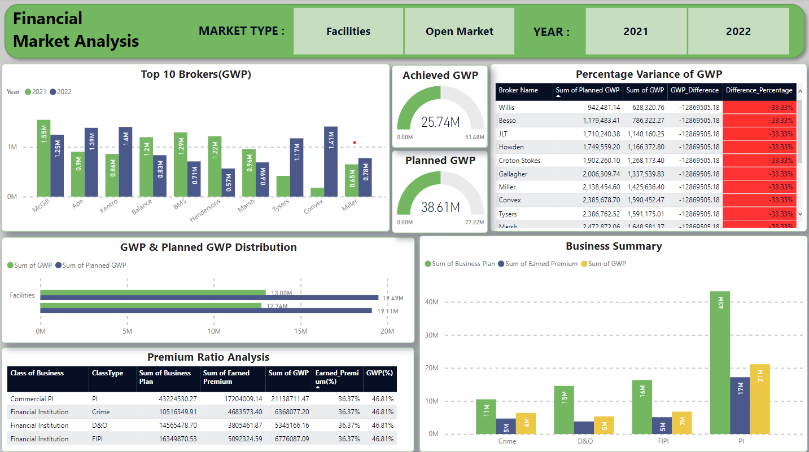
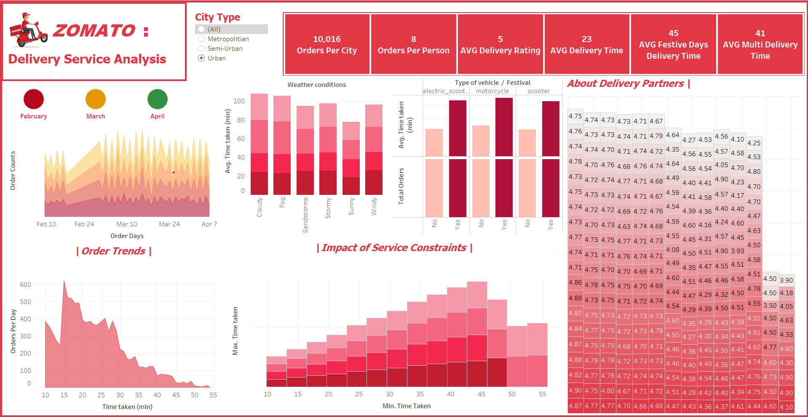

# Business-Intelligence-Projects
This repository is for my personal BI Projects. All the projects here  made  solely using BI tools likes of POWER BI and Tableau.

# Project1
### Insurance Finance Analysis Dashboard
Dataset Link : [Download the Dataset](Dataset/insurance_data.xlsx)

   Dashboard Link : https://app.powerbi.com/view?r=eyJrIjoiMzM3Y2FmZTItMzg3Mi00MzBlLWFlY2MtMDViMTE0ZDI1ZjIxIiwidCI6IjM0YmQ4YmVkLTJhYzEtNDFhZS05ZjA4LTRlMGEzZjExNzA2YyJ9
  
#### Dashboard Screenshot
   

# Project2
Dataset Link :  https://www.kaggle.com/datasets/saurabhbadole/zomato-delivery-operations-analytics-dataset
### Zomato Delivery Services Analysis Dashboard
Dashboard Link: https://public.tableau.com/views/Zomato_Operations_Analytics/Dashboard1?:language=en-US&publish=yes&:sid=&:redirect=auth&:display_count=n&:origin=viz_share_link
  
#### Dashboard Screenshot
   

